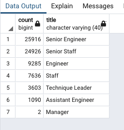
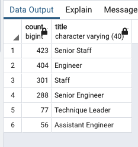

# Pewlett-Hackard-Analysis
SQL analysis


## Project Overview
The purpose for this project is to establish the number and a list of employees that would be retiring to
see how many roles will need to be filled as a result.
Also, instead of having a large chunk of the workforce retire, we want to establish a list of retirees
that would be eligible for part-time work as mentors in our mentoring program.

## Results
Here are the results of the counts by title of retiring employees. Roughly ~73k positions total to back fill.

**Retiring Counts by Title**
```
SELECT 
	COUNT(*),
	title
FROM
	unique_titles
GROUP BY title
ORDER BY 1 DESC
```


Here are the results of number of employees eligible for the Mentoring Program. Roughly 1,550 retirees eligible
to be a mentor.

**Eligible Mentor Counts by Title**

```
SELECT 
	COUNT(*),
	title
FROM
	mentorship_eligibilty
GROUP BY title
ORDER BY 1 DESC
```



Given the ratios, it does not seem like we will have enough mentors to train up the next generation of employees


## Summary

IN summary, Roughly ~73k positions in various levels total will need to be back filled based on the Retiring
Counts by Title query. Only, ~1.5k retiring employees are eligible to come back as mentors for the Mentoring
Program.
Given that would be roughly be an 11 to 1 ratio of qualified retirement-ready employees to mentor the next
generation. Also, assuming ALL retiring employees that are eligible accept to come back as mentors, we do
not believe we would have enough mentors to train up the new back filled employees. 